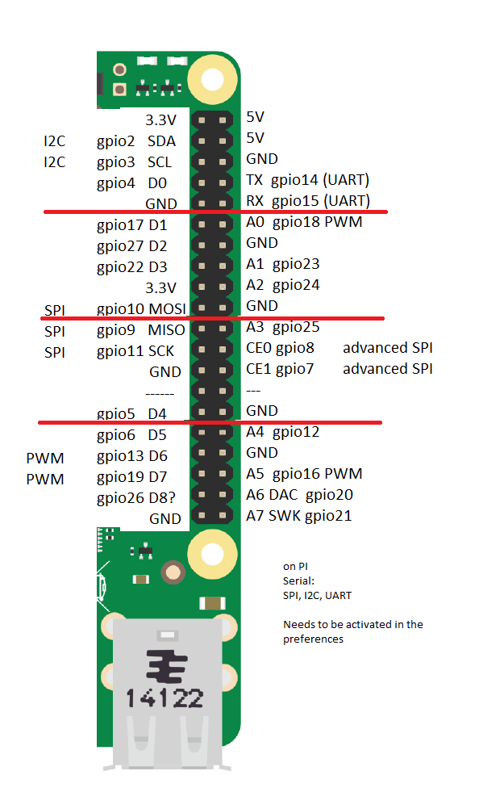
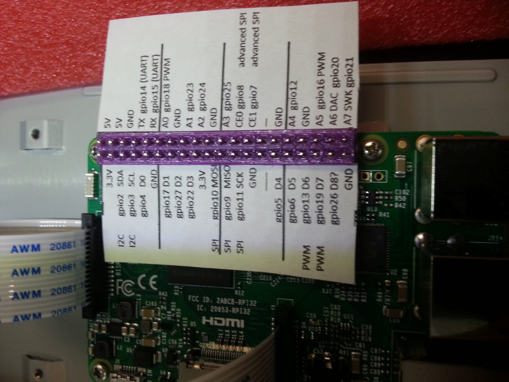

For the Raspberry PI 3 to the http://particle.io Photon

The 3D Printed part just helps hold the paper in place and helps put holes into the paper. When printing the page you may have to adjust the zoom so it fits perfectly.

see the STL
